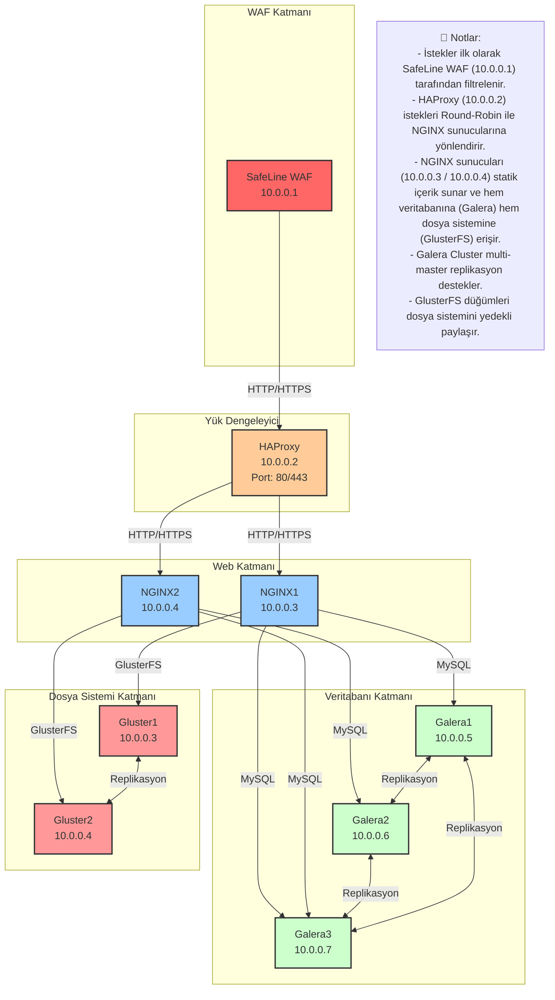

# HA Web Architecture (Yüksek Erişilebilirlikli Web Mimarisi)
Bu döküman, yüksek erişilebilirliğe sahip (High Availability - HA) bir web mimarisinin nasıl inşa edileceğini adım adım açıklamaktadır. Sistemin amacı, kesintisiz hizmet sağlayarak olası donanım veya yazılım hatalarında bile web uygulamalarının çalışmaya devam etmesini sağlamaktır.

Dökümanda, bu yapının temelini oluşturan bileşenlerin kurulumu ve yapılandırması detaylı bir şekilde ele alınmaktadır. Kullanılan ana servisler şunlardır:

## 1. Galera Cluster (MariaDB için)
Galera, veritabanı yüksek erişilebilirlik ve senkron replikasyon için kullanılan bir çözümdür. MariaDB ile birlikte kullanıldığında, birden fazla veritabanı sunucusu üzerinde veri eşzamanlı olarak tutulur. Bu sayede herhangi bir veritabanı düğümünün çökmesi durumunda, diğer düğümler kesintisiz olarak hizmet vermeye devam edebilir.

## 2. GlusterFS (Dağıtık Dosya Sistemi)
GlusterFS, birden fazla sunucu üzerinde veri paylaşımı ve senkronizasyon sağlamak için kullanılan açık kaynaklı bir dağıtık dosya sistemidir. Web sunucuları arasında dosya bütünlüğünü ve eşitliği koruyarak, tüm sunucuların aynı içerikle hizmet verebilmesini sağlar.

## 3. SafeLine (Firewall / Güvenlik Katmanı)
SafeLine, gelen ve giden trafiği kontrol ederek sistemin güvenliğini artırmak için kullanılan bir güvenlik çözümüdür. Web mimarisinde saldırılara karşı ilk savunma hattını oluşturur. Ayrıca DDoS, brute-force gibi saldırılara karşı koruma sağlar.

## 4. HAProxy (Yük Dengeleyici)
HAProxy, istemcilerden gelen trafiği arka planda çalışan birden fazla web sunucusu arasında dağıtarak hem yük dengelemesi hem de yüksek erişilebilirlik sağlar. Aktif-pasif veya aktif-aktif yapılandırmalarla çalışarak sistemin ayakta kalmasını garanti altına alır.

## Yapıya Ait Genel Diyagram

