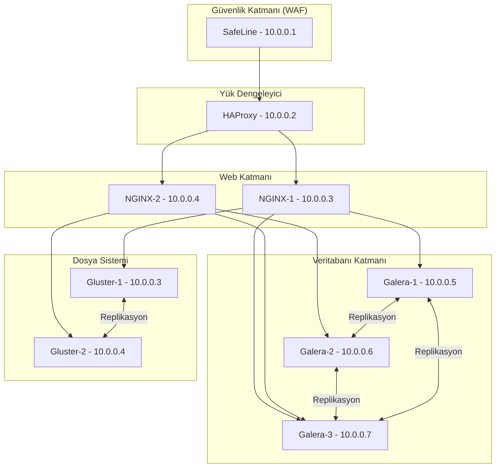
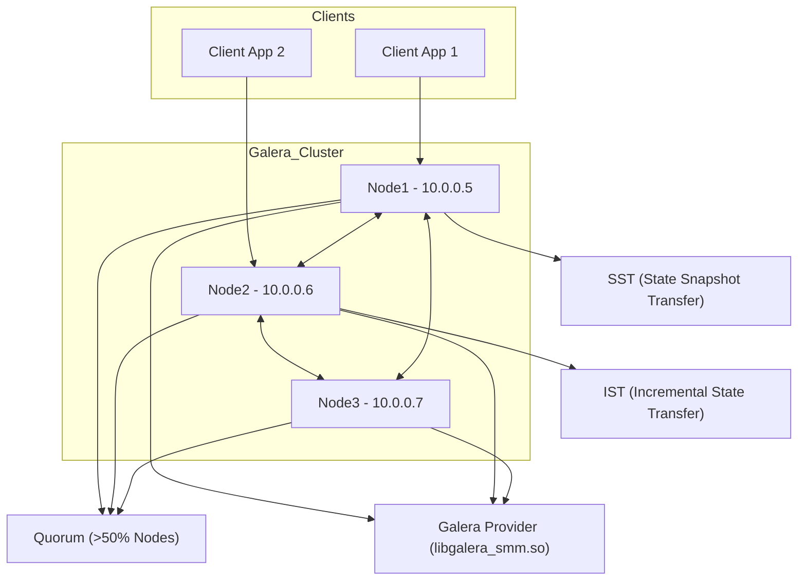

# Yüksek Erişilebilirlik (HA) Web Mimarisi Kılavuzu

## Genel Bakış

Bu belge, yüksek erişilebilirlik (HA) sunan bir web mimarisinin kurulumunu ve yönetimini detaylı bir şekilde açıklamaktadır. Sistem, kesintisiz hizmet sağlamak ve olası arızalara karşı dayanıklılık sunmak için tasarlanmıştır. Aşağıdaki teknolojiler, mimarinin temel taşlarını oluşturur:

- **Galera Cluster**: MariaDB ile senkron replikasyon sunar.
- **GlusterFS**: Dağıtık dosya sistemi ile veri tutarlılığı sağlar.
- **SafeLine**: Güvenlik duvarı ve saldırı koruması.
- **HAProxy**: Yük dengeleme ve yüksek erişilebilirlik.

### Güncelleme

Mimari de bildiğiniz gibi istekler ilk öncelikle WAF katmanına ulaşıyor daha sonra LB ye ulaşıp web sunucularına iletiliyordu. Bu yapıya ek olarak WAF katmanın önüne ekstradan daha güvenlikli olacak şekilde bir HaProxy katmanı daha ekledim. Bu HaProxy katmanı içerisinde bulunan configleri repo üzerinden ulaşabilirsiniz. Config içerisinde gelen istekleri sınırlama, XSS, SQL enjeksiyonu ve HaProxynin stick-table özelliğinden faydalanarak daha güvenlikli bir yapı oluşturdum. Buna ek olarak Web siteleriniz için ülke IP blok engellemeleri, kötü itibarlı IP adreslerinin engellenmesi gibi ekstra configlerde bulunmaktadır. İlgili işlemlerin nasıl yapılacağını aşağıda bırakmış olduğum linkler üzerinden ulaşabilirsiniz. 

https://github.com/ugurcomptech/Haproxy-Abuseipdb-Blocklist
https://github.com/ugurcomptech/Haproxy-Ip2location-Turkey-Filter

## Mimari Diyagramı

Aşağıdaki diyagram, sistemin katmanlarını ve bileşenler arasındaki bağlantıları görselleştirir:



---

## 1. Galera Cluster (MariaDB)

Galera Cluster, MariaDB ile entegre çalışarak yüksek erişilebilirlik ve veri tutarlılığı sağlar. Birden fazla veritabanı düğümü arasında senkron replikasyon gerçekleştirir, böylece herhangi bir düğüm arızasında hizmet kesintisiz devam eder.

### Cluster Yapılandırması

| Node  | IP Adresi | Hostname |
|-------|-----------|----------|
| Node1 | 10.0.0.5  | node1    |
| Node2 | 10.0.0.6  | node2    |
| Node3 | 10.0.0.7  | node3    |

### Galera Cluster Diyagramı



### Örnek `my.cnf` Yapılandırması

```ini
[mysqld]
binlog_format=ROW
default-storage-engine=innodb
innodb_autoinc_lock_mode=2
bind-address=0.0.0.0

# Galera Provider Configuration
wsrep_on=ON
wsrep_provider=/usr/lib/galera/libgalera_smm.so

# Galera Cluster Configuration
wsrep_cluster_name="galera_cluster"
wsrep_cluster_address="gcomm://10.0.0.5,10.0.0.6,10.0.0.7"

# Galera Synchronization Configuration
wsrep_sst_method=rsync

wsrep_node_name="nodeX"          # Node adına göre düzenleyin
wsrep_node_address="10.0.0.X"    # Node IP'sine göre düzenleyin
```

### Kurulum Adımları

1. **MariaDB ve Galera Kurulumu**:
   ```bash
   sudo apt update
   sudo apt install mariadb-server galera-4 rsync -y
   ```

2. **Yapılandırma Dosyasını Düzenleme**:
   - Her node için `my.cnf` dosyasını ilgili IP ve node adıyla güncelleyin.

3. **Güvenlik Duvarı Ayarları**:
   ```bash
   sudo ufw allow 3306/tcp  # MariaDB
   sudo ufw allow 4567/tcp  # Galera Replikasyon
   sudo ufw allow 4568/tcp  # IST
   sudo ufw allow 4444/tcp  # SST
   sudo ufw enable
   ```

4. **Cluster Başlatma**:
   - İlk node'da:
     ```bash
     sudo galera_new_cluster
     ```
   - Diğer node'larda:
     ```bash
     sudo systemctl start mariadb
     ```

### Cluster Durumunu Kontrol Etme

```bash
mysql -u root -p -e "SHOW STATUS LIKE 'wsrep_cluster_size';"
```

- `wsrep_cluster_size` 3 ise, cluster sağlıklıdır.
- Farklı bir değer, senkronizasyon sorununa işaret eder.

### Veri Testi

1. MariaDB’ye bağlanın:
   ```bash
   mysql -u root -p
   ```

2. Test veritabanı oluşturun:
   ```sql
   CREATE DATABASE testdb;
   USE testdb;
   CREATE TABLE users (
       id INT AUTO_INCREMENT PRIMARY KEY,
       name VARCHAR(100) NOT NULL
   );
   ```

3. Kayıt ekleyin:
   ```sql
   INSERT INTO users (name) VALUES ('Galera User 1');
   ```

4. Diğer node’larda kontrol edin:
   ```sql
   SELECT * FROM users;
   ```

---

## 2. GlusterFS (Dağıtık Dosya Sistemi)

GlusterFS, web sunucuları arasında dosya senkronizasyonu sağlar ve veri bütünlüğünü korur. Açık kaynaklı bu sistem, tüm sunucuların aynı içeriği sunmasını garanti eder.

### Kurulum Adımları

1. **GlusterFS Kurulumu** (Her iki node: web1, web2):
   ```bash
   sudo apt update
   sudo apt install -y glusterfs-server
   sudo systemctl start glusterd
   sudo systemctl enable glusterd
   sudo systemctl status glusterd
   ```

2. **Güvenlik Duvarı Ayarları**:
   ```bash
   sudo ufw allow 24007/tcp
   sudo ufw allow 49152:49162/tcp
   sudo ufw allow from 10.0.0.3 to any
   sudo ufw allow from 10.0.0.4 to any
   ```

3. **Peer Yapılandırması**:
   - Primary Node (web1):
     ```bash
     sudo gluster peer probe 10.0.0.4
     sudo gluster peer status
     ```
   - Secondary Node (web2):
     ```bash
     sudo gluster peer probe 10.0.0.3
     sudo gluster peer status
     ```

4. **Volume Oluşturma**:
   - Her iki node’da:
     ```bash
     sudo mkdir -p /data/web
     ```
   - Primary Node’da:
     ```bash
     sudo gluster volume create web-vol replica 2 10.0.0.3:/data/web 10.0.0.4:/data/web force
     sudo gluster volume start web-vol
     sudo gluster volume info
     ```

5. **Web Dosyalarını Senkronize Etme**:
   - Her iki node’da:
     ```bash
     sudo mkdir -p /var/www/html
     sudo mount -t glusterfs 10.0.0.3:/web-vol /var/www/html
     df -h | grep web-vol
     echo "10.0.0.3:/web-vol /var/www/html glusterfs defaults,_netdev 0 0" | sudo tee -a /etc/fstab
     ```
   - Primary Node’da test dosyası:
     ```bash
     echo "GlusterFS cluster testi başarılı!" | sudo tee /var/www/html/test.html
     ```

6. **Nginx Yapılandırması**:
   ```bash
   sudo apt install -y nginx
   sudo cat /etc/nginx/sites-available/default
   sudo systemctl restart nginx
   ```

---

## 3. SafeLine (Güvenlik Katmanı)

SafeLine, DDoS, brute-force ve diğer saldırılara karşı koruma sağlayan bir Web Application Firewall (WAF) çözümüdür.

### Kurulum Adımları

1. **Docker Kurulumu**:
   ```bash
   sudo apt install docker.io -y
   ```

2. **SafeLine Kurulumu**:
   ```bash
   bash -c "$(curl -fsSLk https://waf.chaitin.com/release/latest/setup.sh)"
   ```

3. **Güvenlik Duvarı Ayarları**:
   ```bash
   sudo ufw allow 9443
   sudo ufw reload
   ```

4. **Web Arayüzü**:
   - Tarayıcıda `https://<IP>:9443` adresine giderek yapılandırmayı tamamlayın.
   - Daha fazla bilgi için: [SafeLine GitHub](https://github.com/chaitin/SafeLine).

**NOT:** SafeLine WAF’ın port 80 üzerindeki birden fazla uygulamayı yönetme sorunu, tek dinleyici kısıtlaması ve yol tabanlı yönlendirme eksikliğinden kaynaklanır. Tek dinleyici kısıtlaması, SafeLine’ın önyüzde yalnızca tek bir port 80 dinleyicisi tanımlayabilmesi anlamına gelir. Eğer birden fazla uygulama aynı portu kullanmak isterse, SafeLine hangi uygulamanın arka uç sunucusuna yönlendirme yapacağını bilemez ve "duplicate port error" hatası oluşur. Bu, SafeLine’ın mimari tasarımının bir sonucudur ve aynı port üzerinden gelen istekleri ayırt etmek için ek bir mekanizmaya ihtiyaç duyar. Çözüm olarak, her uygulama için farklı bir domain veya alt domain (örneğin, app1.example.com, app2.example.com) kullanılarak Host tabanlı yönlendirme yapılır. Böylece SafeLine, HTTP Host başlığına göre istekleri doğru sunucuya yönlendirir.

Yol tabanlı yönlendirme eksikliği ise SafeLine’ın URL yollarına (örneğin, example.com/app1, example.com/app2) göre istekleri ayırt edememesinden kaynaklanır. Modern ters vekil sunucularında yaygın olan bu özellik, SafeLine’ın mevcut sürümünde bulunmaz ve bu durum, birden fazla uygulamanın tek bir domain altında farklı yollarla çalışmasını engeller. Bu eksiklik, SafeLine’ın daha basit ve performans odaklı bir tasarım hedeflemesinden veya geliştirme önceliklerinden kaynaklanabilir. Sonuç olarak, SafeLine ile birden fazla uygulamayı port 80 üzerinde çalıştırmak için domain tabanlı yönlendirme zorunludur; yol tabanlı yönlendirme için ise Nginx gibi başka bir ters vekil sunucusuyla entegrasyon düşünülebilir. 

Konuyla ilgili daha fazla bilgi için [buraya tıklayabilirsiniz.](https://dev.to/carrie_luo1/safeline-waf-setup-how-to-handle-multiple-apps-on-port-80-2blb)

---

## 4. HAProxy (Yük Dengeleyici)

HAProxy, istemci trafiğini web sunucuları arasında dağıtarak yük dengeleme ve yüksek erişilebilirlik sağlar.

### Kurulum Adımları

1. **HAProxy Kurulumu**:
   ```bash
   sudo apt install haproxy -y
   ```

2. **Yapılandırma Dosyasını Düzenleme**:
   ```bash
   sudo nano /etc/haproxy/haproxy.cfg
   ```

3. **Örnek Yapılandırma**:
   ```cfg
   global
       log /dev/log local0
       maxconn 4096
       user haproxy
       group haproxy
       daemon

   defaults
       log global
       mode http
       option httplog
       option dontlognull
       timeout connect 5000
       timeout client 50000
       timeout server 50000

   frontend http_front
       bind *:80
       bind *:443 ssl crt /etc/haproxy/certs/yourdomain.pem
       mode http
       option forwardfor
       default_backend web_backend

   backend web_backend
       mode http
       balance roundrobin
       server web1 10.0.0.3:80 check
       server web2 10.0.0.4:80 check
   ```

4. **Servisi Yeniden Başlatma**:
   ```bash
   sudo systemctl restart haproxy
   ```

---

## Önemli Notlar

- **SafeLine**:
  - Uygulama eklerken **Reverse Proxy** seçin.
  - SSL kullanıyorsanız, `HTTPS` protokolünü belirtin.
  - "Too Many Redirects" hatasını önlemek için yalnızca 443 portunu açık tutun.

- **HAProxy**:
  - Birden fazla SSL sertifikası için `/haproxy` dizinindeki notları inceleyin.

- **Genel**:
  - Tüm yapılandırmalar test edilmelidir.
  - Güvenlik duvarı ayarları, ağ yapılandırmanıza göre özelleştirilmelidir.
