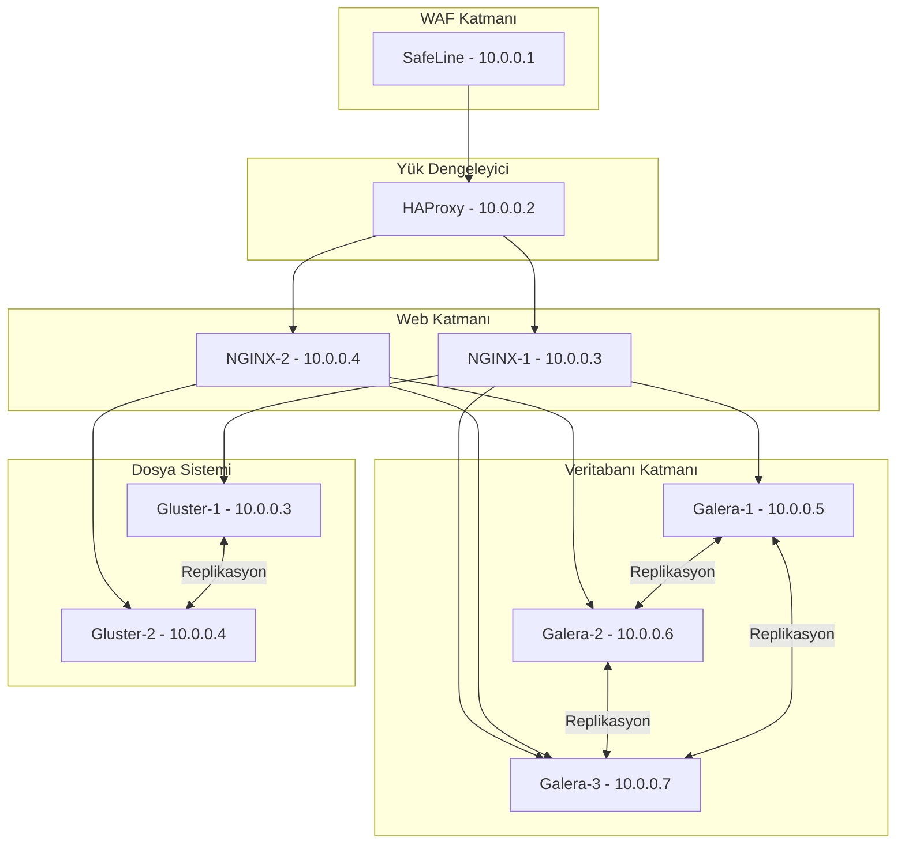
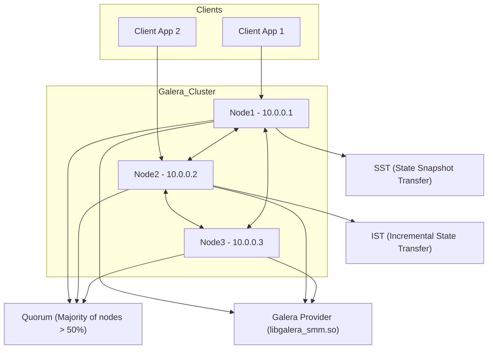

# HA Web Architecture (Yüksek Erişilebilirlikli Web Mimarisi)
Bu döküman, yüksek erişilebilirliğe sahip (High Availability - HA) bir web mimarisinin nasıl inşa edileceğini adım adım açıklamaktadır. Sistemin amacı, kesintisiz hizmet sağlayarak olası donanım veya yazılım hatalarında bile web uygulamalarının çalışmaya devam etmesini sağlamaktır.

Dökümanda, bu yapının temelini oluşturan bileşenlerin kurulumu ve yapılandırması detaylı bir şekilde ele alınmaktadır. Kullanılan ana servisler şunlardır:

## 1. Galera Cluster (MariaDB için)
Galera, veritabanı yüksek erişilebilirlik ve senkron replikasyon için kullanılan bir çözümdür. MariaDB ile birlikte kullanıldığında, birden fazla veritabanı sunucusu üzerinde veri eşzamanlı olarak tutulur. Bu sayede herhangi bir veritabanı düğümünün çökmesi durumunda, diğer düğümler kesintisiz olarak hizmet vermeye devam edebilir.

## 2. GlusterFS (Dağıtık Dosya Sistemi)
GlusterFS, birden fazla sunucu üzerinde veri paylaşımı ve senkronizasyon sağlamak için kullanılan açık kaynaklı bir dağıtık dosya sistemidir. Web sunucuları arasında dosya bütünlüğünü ve eşitliği koruyarak, tüm sunucuların aynı içerikle hizmet verebilmesini sağlar.

## 3. SafeLine (Firewall / Güvenlik Katmanı)
SafeLine, gelen ve giden trafiği kontrol ederek sistemin güvenliğini artırmak için kullanılan bir güvenlik çözümüdür. Web mimarisinde saldırılara karşı ilk savunma hattını oluşturur. Ayrıca DDoS, brute-force gibi saldırılara karşı koruma sağlar.

## 4. HAProxy (Yük Dengeleyici)
HAProxy, istemcilerden gelen trafiği arka planda çalışan birden fazla web sunucusu arasında dağıtarak hem yük dengelemesi hem de yüksek erişilebilirlik sağlar. Aktif-pasif veya aktif-aktif yapılandırmalarla çalışarak sistemin ayakta kalmasını garanti altına alır.

## Yapıya Ait Genel Diyagram



## Galera Cluster 

MariaDB veritabanı, Galera ile senkronize çalışarak yüksek erişilebilirlik (HA) ve veri tutarlılığı sağlar.

## 🌐 Cluster Yapılandırması

| Node  | IP Adresi   | Hostname |
|-------|-------------|----------|
| Node1 | 10.0.0.1    | node1    |
| Node2 | 10.0.0.2    | node2    |
| Node3 | 10.0.0.3    | node3    |

---



---

## ⚙️ Örnek `my.cnf` Yapılandırması

(Detaylı yapılandırmalar her node için `node1/my.cnf`, `node2/my.cnf`, `node3/my.cnf` klasörlerinde yer alır.)

```ini
[mysqld]
binlog_format=ROW
default-storage-engine=innodb
innodb_autoinc_lock_mode=2
bind-address=0.0.0.0

# Galera Provider Configuration
wsrep_on=ON
wsrep_provider=/usr/lib/galera/libgalera_smm.so

# Galera Cluster Configuration
wsrep_cluster_name="galera_cluster"
wsrep_cluster_address="gcomm://10.0.0.1,10.0.0.2,10.0.0.3"

# Galera Synchronization Configuration
wsrep_sst_method=rsync

wsrep_node_name="nodeX"          # Node ismine göre değiştir
wsrep_node_address="10.0.0.X"    # Node IP adresine göre değiştir
```

---

## 🔧 Kurulum Adımları

1. **MariaDB ve Galera kurulumu:**

```bash
sudo apt update
sudo apt install mariadb-server galera-4 rsync -y
```

2. **Yapılandırma dosyasını düzenleyin** (Her node için kendi IP ve node adı ile).

3. **Firewall Ayarları (Tüm Node'larda):**

```bash
sudo ufw allow 3306/tcp      # MariaDB portu
sudo ufw allow 4567/tcp      # Galera Cluster replication portu
sudo ufw allow 4568/tcp      # Incremental State Transfer (IST) portu
sudo ufw allow 4444/tcp      # State Snapshot Transfer (SST) portu
sudo ufw enable
```

4. **İlk Node'da Cluster başlatın:**

```bash
sudo galera_new_cluster
```

5. **Diğer Node'ları başlatın:**

```bash
sudo systemctl start mariadb
```

---

## 🩺 Cluster Durumunu Kontrol Etme

```bash
mysql -u root -p -e "SHOW STATUS LIKE 'wsrep_cluster_size';"
```

- Eğer **wsrep_cluster_size** değeri 3 ise, tüm node'lar birbirine başarılı şekilde bağlanmış ve senkronizedir.
- 1 veya farklı bir sayı görüyorsanız, cluster tam oluşmamıştır.

---

## 💾 Veri Ekleme ve Test Etme

Herhangi bir node üzerinden aşağıdaki komutları kullanarak cluster üzerinde veri ekleyip senkronizasyonu test edebilirsiniz.

1. **MariaDB’ye bağlanın:**

```bash
mysql -u root -p
```

2. **Test için yeni bir veritabanı oluşturun:**

```sql
CREATE DATABASE testdb;
USE testdb;
CREATE TABLE users (
    id INT AUTO_INCREMENT PRIMARY KEY,
    name VARCHAR(100) NOT NULL
);
```

3. **Bir kayıt ekleyin:**

```sql
INSERT INTO users (name) VALUES ('Galera User 1');
```

4. **Diğer node’lardan veriyi kontrol edin:**

Diğer node’larda `mysql -u root -p testdb` ile bağlanıp:

```sql
SELECT * FROM users;
```

- Eklediğiniz kayıtların diğer node’larda da görünmesi gerekir.
- Eğer görünmüyorsa, cluster bağlantısı veya senkronizasyon ile ilgili sorun vardır.


